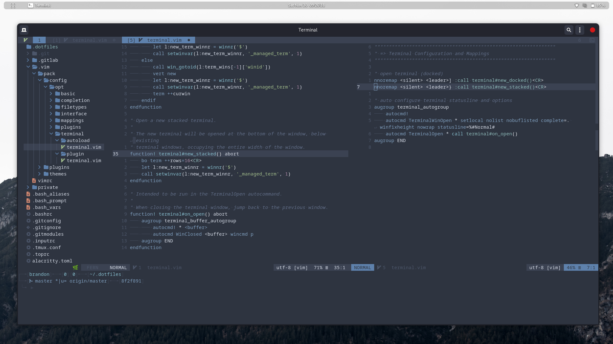

# Brandon's Dotfiles
Here's where I dump all my config files. Maybe you'll find them useful.

Here's what I have configured so far:
- bash configuration
- pureline (a powerline alternative) configuration
- vim configuration and plugins (submodules)
- top configuration
- git configuration and hooks

My goal with this project is to be reasonably self-sufficient and easy to
install.




## Prerequisites
There are very few prerequisites.
- GNU Make (available in most environments)
- [powerline patched fonts](https://github.com/powerline/fonts)
(if you want to use pureline bash prompt)


## Installation (basic)
Simple.

```
$ git clone --recurse-submodules git@github.com:brandon1024/.dotfiles.git
$ make
```

This will install all dotfiles by creating symlinks to dotfiles in this project.
Existing dotfiles/symlinks are overwritten.


## Installation (customized)
### Install (dryrun)
See what commands will be run:

```
$ DOTFILES_DRYRUN=1 make
```

### Install (symlinks, no overwrite)
Avoid overwriting existing dotfiles with symlinks to dotfiles in this project.

```
$ DOTFILES_OVERWRITE=yes make
```

### Install (copy)
Overwrite existing files (if they exist) by coping dotfiles from this project.

```
$ make hard
```

### Install All Except
Pick and choose which dotfiles you want to install.

```
$ # list supported variables with:
$ make help

$ DOTFILES_NO_BASHRC=1 DOTFILES_NO_TMUX=1 make
```

## Extra
### Generating Vim Help Tags
With native vim packages, help tags are not generated automatically. It's
easy enough though:
```bash
$ make vimpack-helptags
```

### Vim Clipboard Support
I created a command that copies the selection to your clipboard (in a snippet
format). This command requires `+clipboard`. If you want to use this, you'll
need to use a version of Vim compiled with `+clipboard`. In Debian, this can be
installed with `vim-gtk`.
